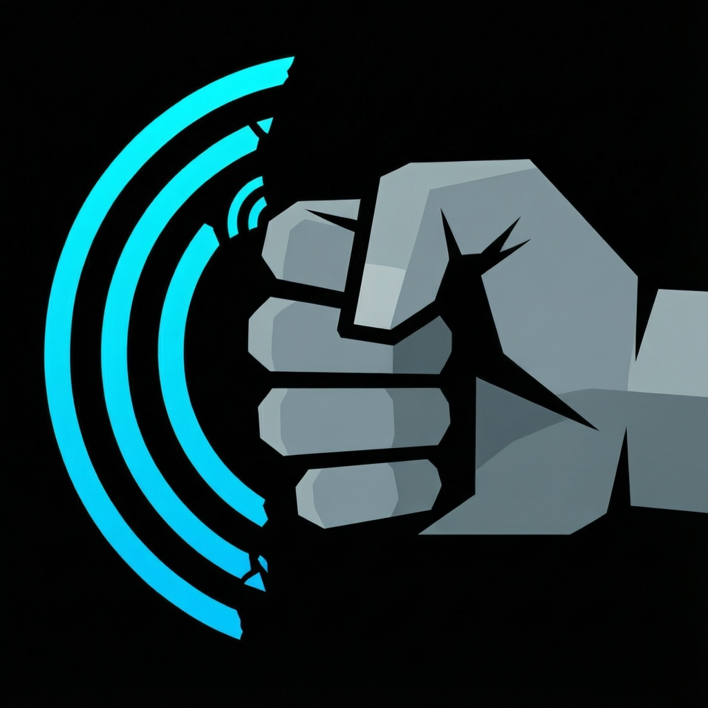

<p align="center">
  
</p>

# Clutch
Cellular security monitor for iOS, macOS, and Linux — v1.0

<p align="center">
  <a href="LICENSE"></a>
  
  <a href="https://github.com/ghostintheprompt/clutch/releases"></a>
</p>

---

Clutch detects IMSI catchers, signal downgrades, and cellular surveillance equipment using machine learning and coordinated threat intelligence.

Built for journalists, activists, researchers, and security professionals who cannot always go dark — and need better information than their phone currently gives them.

---

## The Problem

Your phone trusts cell towers the way a tourist trusts a street vendor. It finds the strongest signal and connects. It does not verify the tower is legitimate. That trust model was designed before portable fake towers were a field reality.

An IMSI catcher — a Stingray, DRT box, or cell-site simulator — exploits that trust. It impersonates a legitimate tower, captures your IMSI, and depending on sophistication: tracks your location, intercepts calls, downgrades your encryption, or runs a full man-in-the-middle on your cellular layer. Your phone does not tell you when this happens. It silently connects and keeps moving.

The advice is usually "leave your phone at home." That advice fails in the field. A journalist has sources on that phone. A fixer has navigation. An activist has the organizing thread. Operational silence is not always available as a choice. Clutch is for the situations where it is not.

---

## What It Detects

| Signal | What It Means |
|---|---|
| Forced technology downgrade | LTE → 3G → 2G without network justification. Older protocols have weaker or no encryption. |
| RSSI jump +25 dBm or more | A tower kilometers away does not suddenly read as if it is standing next to you. |
| Timing advance zero | TA=0 means the tower is physically adjacent. If there is no tower adjacent, that is not normal. |
| Cell ID out of range | Tower IDs operate within known geographic ranges. An ID that does not match the area is a flag. |
| Encryption downgrade | A5/3 → A5/1 → None. Each step removes a layer of protection. |
| Non-standard frequency | Operating outside carrier-standard frequencies for the location. |

No single indicator is proof. Clutch watches for patterns across indicators, in context, in real time.

---

## Detection Stack

**iOS App** — CoreTelephony integration for actual cellular hardware data, not approximations. 4-tab interface: Dashboard, Cellular, Alerts, Settings. Local ML threat analysis. Optional WebSocket client for coordinated team intelligence.

**Python Backend** — Multi-platform cellular data collection (macOS `system_profiler`, Linux ModemManager). Machine learning models (IsolationForest, DBSCAN) for anomaly detection. RF fingerprinting, timing analysis, and Active Defense null-routing.

**Remote Coordination Server** — WebSocket server for real-time threat sharing across devices. Device authentication, OPSEC AES-256 encryption, API key management, and geographic threat correlation. For teams that need shared cellular intelligence across multiple monitoring points.

### 👻 Ghost-Protocol Capabilities
- **OPSEC E2EE Telemetry:** AES-256-CBC encrypted WebSocket traffic. Even if the network is tapped, adversaries cannot read your threat alerts or know you are running Clutch.
- **SDR Passive Verification:** Stub interface ready for RTL-SDR/HackRF. Scans the RF spectrum to find "Phantom Towers" that are broadcasting but hiding from your OS's neighbor list.
- **Automated Null-Routing (Kill-Switch):** Active defense module that instantly null-routes all non-essential traffic if an IMSI catcher is confirmed (0.90+ confidence), protecting you from exploits delivered over the rogue tower.
- **Geographic SIGINT Heatmap:** Correlates threats across multiple devices into a live Leaflet.js dashboard, creating a visual map of active surveillance zones.

---

## What a Detection Looks Like

```
IMSI CATCHER DETECTED

Threat Type: IMSI_CATCHER_SUSPECTED
Severity: HIGH
Confidence: 0.85

Evidence:
- Signal jump: +28 dBm (threshold: 25 dBm)
- Timing advance: 0 (suspicious proximity)
- Encryption: Downgraded A5/3 → None
- Frequency: 1950 MHz (non-standard)
- Cell ID: Out of valid range

Mitigation:
- Avoid sensitive communications immediately
- Move location if tactically safe
- Enable airplane mode if appropriate
- Monitor for pattern consistency
```

Mitigation suggestions are defaults. Sensitivity thresholds, alert behavior, and remote sharing are all configurable. The tool gives you signal. You decide what to do with it.

---

## Install

### Download

[Latest release](https://github.com/ghostintheprompt/clutch/releases) — Python backend as a zip archive.

### Homebrew

```bash
brew install --cask ghostintheprompt/clutch/clutch
```

### Build from source

```bash
git clone https://github.com/ghostintheprompt/clutch
cd clutch
python3 -m venv venv && source venv/bin/activate
pip install -r requirements.txt
./quick_start.sh
```

**iOS setup:**
```bash
open iOS-App/NetworkSecurityMonitor.xcodeproj
# Settings → Remote Monitoring → Setup
# Server URL: ws://your-server:8766
# API Key: from server startup logs
```

---

## Requirements

- **iOS:** 14.0+ (mobile monitoring app)
- **macOS:** 10.15+ (desktop monitoring)
- **Python:** 3.8+ with scientific libraries (`pip install -r requirements.txt`)
- **RAM:** 512MB minimum, 1GB recommended for ML features

**Permissions required:**
- Location Services (iOS) — geo-mapping detected equipment
- Cellular Data Access (iOS) — reading actual cellular hardware state
- Full Disk Access (macOS) — accessing system cellular information
- Network Access — for optional remote coordination only

---

## Architecture

```
clutch/
├── iOS-App/                    # Swift CoreTelephony monitoring app
│   └── NetworkSecurityMonitor/ # 2,100+ lines, real cellular hardware access
├── scripts/                    # Python detection backend
├── docs/                       # Technical documentation
├── quick_start.sh              # Deployment entry point
├── requirements.txt            # Python dependencies
└── cellular_remote_config.json # Remote coordination configuration
```

---

## Privacy

- All threat detection runs locally on your device
- No telemetry, no analytics, no user tracking
- Remote sharing is opt-in and configurable — nothing leaves the device unless you configure it
- WebSocket connections support optional SSL/TLS
- No content interception — detects surveillance, does not conduct it

---

## Who This Is For

Journalists in environments where cellular surveillance is documented. Activists in jurisdictions with known IMSI catcher deployments. Security professionals verifying cellular integrity in sensitive locations. Researchers and red teamers who need to know whether the blue team has the cellular layer covered.

The threat varies by context. The tool is built to be adjustable to the threat.

---

## Open Source

Surveillance detection software that asks for trust without showing its work has a structural problem. The thing it is supposed to protect you from operates through opacity. A defensive tool should not imitate that.

The detection algorithms are readable. The data handling is auditable. Fork it, modify it, extend it to fit your threat model.

MIT License.

---

Full context and operational philosophy: [ghostintheprompt.com/articles/clutch](https://ghostintheprompt.com/articles/clutch)

---

<sub>Built by <a href="https://mdrn.app">MDRN Corp</a> — <strong>github.com/ghostintheprompt/clutch</strong></sub>
